# 🐳 MobyAgent: The Whale that never blinks


> A security-hardened AI agent reference architecture using Docker MCP Gateway, Docker Model Runner, and production-ready best practices.

[](https://docker.com)
[](https://github.com/ajeetraina/agentmoby)
[](https://docs.docker.com/ai/mcp-gateway/)

## 🎯 Overview

MobyAgent demonstrates a **security-first approach** to building AI agents in production environments. Named after Docker's iconic whale mascot, this "whale that never blinks" maintains constant vigilance against AI security threats while delivering powerful agentic capabilities.

### Why MobyAgent?

Current AI agent deployments often sacrifice security for convenience:
- ❌ Direct host access with `npx` and `uvx` commands
- ❌ No network isolation or resource limits  
- ❌ Unverified tool supply chains
- ❌ No protection against prompt injection attacks
- ❌ Missing audit trails and monitoring

MobyAgent changes this paradigm:
- ✅ **Container isolation**: Every component runs in hardened containers
- ✅ **Zero-trust networking**: Internal-only networks with strict access controls
- ✅ **Supply chain security**: Cryptographically signed, verified images
- ✅ **Intelligent interceptors**: Real-time threat detection and blocking
- ✅ **Comprehensive monitoring**: Full audit trails with Wazuh integration
- ✅ **Prompt injection defense**: Multi-layered protection strategies

## 🏗️ Architecture

```mermaid
graph TB
    subgraph "Public Network"
        UI[Agent UI Container<br/>Port 3000]
        Monitor[Wazuh Security<br/>Port 443]
    end
    
    subgraph "DMZ Network"
        Gateway[MCP Gateway<br/>Interceptors + Auth<br/>Port 8080]
    end
    
    subgraph "Internal Network"
        Agent[Agent Container<br/>Mastra + Logic<br/>Rootless]
        LLM[Docker Model Runner<br/>Local LLM<br/>No Internet]
    end
    
    subgraph "Interceptors"
        PreInt[Before Interceptors<br/>• Prompt Filter<br/>• Rate Limiter<br/>• Auth Validator]
        PostInt[After Interceptors<br/>• Response Filter<br/>• Audit Logger<br/>• Secret Scanner]
    end
    
    UI --> Gateway
    Gateway --> PreInt
    PreInt --> Agent
    Agent --> LLM
    Agent --> PostInt
    PostInt --> Monitor
    
    classDef public fill:#ff9999
    classDef dmz fill:#ffcc99
    classDef internal fill:#99ff99
    classDef security fill:#99ccff
    
    class UI,Monitor public
    class Gateway dmz
    class Agent,LLM internal
    class PreInt,PostInt security
```



## 🚀 Quick Start

Deploy the entire secure agent infrastructure with a single command:

```bash
git clone https://github.com/ajeetraina/agentmoby.git
cd agentmoby
docker compose up -d
```

Access the agent UI at `http://localhost:3000` and start asking questions safely!

## 🛡️ Security Features

### 1. Container Isolation
- All components run in separate, hardened containers
- Rootless execution with minimal privileges
- Resource limits (CPU/Memory) prevent resource exhaustion
- No direct host filesystem access

### 2. Network Segmentation
```yaml
networks:
  public:     # Agent UI only
  dmz:        # MCP Gateway 
  internal:   # Agent + LLM (no internet access)
  monitoring: # Wazuh security monitoring
```

### 3. Intelligent Interceptors

**Before Interceptors** (Request Filtering):
- `prompt-injection-guard.py`: Detects and blocks malicious prompts
- `rate-limiter.sh`: Prevents DoS attacks
- `auth-validator.py`: Validates authentication tokens
- `tool-access-control.py`: Enforces tool permission boundaries

**After Interceptors** (Response Processing):
- `response-sanitizer.py`: Filters sensitive data from responses
- `audit-logger.py`: Creates comprehensive audit trails
- `secret-scanner.py`: Detects accidentally exposed secrets
- `anomaly-detector.py`: Identifies unusual behavior patterns

### 4. Supply Chain Security
- All images use Docker Hardened Images (DHI)
- Cryptographic signature verification
- Software Bill of Materials (SBOM) included
- Vulnerability scanning with Trivy

## 📊 Monitoring & Observability

### Wazuh Integration
- Real-time security event monitoring
- Threat detection and response
- Compliance reporting
- Integration with SIEM systems

### Metrics Dashboard
- Request/response latencies
- Tool usage patterns  
- Security event counts
- Resource utilization

## 🧪 Security Testing

The reference architecture includes automated tests for common AI security threats:

```bash
# Test prompt injection resistance
./scripts/test-prompt-injection.sh

# Test tool poisoning prevention
./scripts/test-tool-poisoning.sh

# Test task divergence protection
./scripts/test-task-divergence.sh

# Full security audit
./scripts/security-audit.sh
```

## 🏢 Production Deployment

### Cloud Deployment
Deploy to any cloud provider using our Terraform modules:

```bash
cd terraform/aws  # or azure, gcp
terraform init
terraform apply
```

### Kubernetes
Deploy on Kubernetes with Helm:

```bash
helm install mobyagent ./charts/mobyagent
```

## 🤝 Contributing

We welcome contributions! See our [Security Guidelines](SECURITY.md) for secure development practices.

## 📚 Documentation

- [Architecture Deep Dive](docs/architecture.md)
- [Interceptor Development](docs/interceptors.md)
- [Security Best Practices](docs/security.md)
- [Deployment Guide](docs/deployment.md)
- [API Reference](docs/api.md)

## 🎬 Demo Videos

- [🎥 5-Minute Demo](https://youtu.be/demo) - Quick overview and deployment
- [🎥 Security Deep Dive](https://youtu.be/security) - Threat protection in action
- [🎥 Production Setup](https://youtu.be/production) - Enterprise deployment guide

## 🏆 Why This Matters

AI agents are rapidly moving from labs to production, but current security practices haven't kept pace. MobyAgent provides:

1. **Real-world security**: Tested against actual attack vectors
2. **Production-ready**: Enterprise-grade monitoring and compliance
3. **Developer-friendly**: Simple deployment with `docker compose up`
4. **Extensible**: Add new tools and interceptors easily
5. **Community-driven**: Open source with active development

## 🔮 Future Roadmap

- [ ] Multi-agent orchestration support
- [ ] Advanced prompt injection ML models
- [ ] Integration with additional LLM providers
- [ ] Mobile app for agent management
- [ ] Advanced threat hunting capabilities

